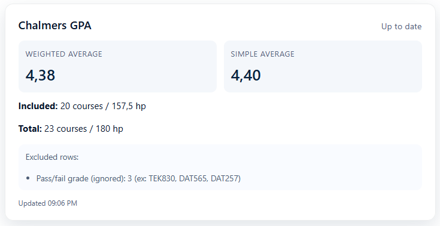

# Chalmers GPA Calculator 

Chrome extension that reads the course table on [mex.portal.chalmers.se](https://mex.portal.chalmers.se) and shows your weighted and simple grade averages directly on the page. The extension popup also provides quick instructions and a link to the correct view.

  
  
<em>Note: The preview includes dummy data.</em>

## What it does

- Injects a small panel on the transcript page with:
  - Weighted average grade (by hp)
  - Simple average grade
  - Count of courses and credits that were included vs. total
  - Information about rows that were skipped (missing grade or credits)
- Adds a popup (`action` button) that fetches the same stats on demand.
- Automatically recalculates whenever the table contents change.

## Grading model

Chalmers uses criterion-referenced assessments with two scales: the numeric scale `U, 3, 4, 5` and the pass/fail scale `U/G` for some courses such as degree projects [(Chalmers University of Technology)](https://www.chalmers.se/en/education/your-studies/plan-and-conduct-your-studies/grading-system/). There is no official GPA, so the extension computes an unofficial weighted average where:

- `3`, `4`, and `5` are taken as-is.
- `G`/`Pass` rows are **excluded entirely** (they neither help nor harm the averages), matching the typical approach of only averaging numeric grades.
- `U` (fail) is treated as `0` to reflect missing course completion.

## Installation

### Prebuilt

1. Download the latest `chalmers-gpa-calculator-<version>.zip` from the [GitHub Releases](https://github.com/chrille0313/chalmers-gpa-calculator/releases).
2. Unzip it to a convenient folder.
3. In Chrome, open `chrome://extensions`, enable _Developer mode_, and choose _Load unpacked_.
4. Select the extracted folder to load the extension.

### Build yourself

1. Install dependencies with `npm install`.
2. Run `npm run build` to emit the extension into `extension/`.
3. Load `extension/` as an unpacked extension in `chrome://extensions`.

## Usage

1. Make sure the extension is enabled in Chrome (via the unpacked build or Web Store install).
2. Navigate to [mex.portal.chalmers.se](https://mex.portal.chalmers.se) and sign in.
3. Open the **Achievements** tab (Swedish: _Prestationer_). The GPA card will inject above the course table, and the popup will show the same stats.

## Development

- Source TypeScript lives in `src/`. Run `npm run build` after making changes, then refresh the extension in `chrome://extensions`.
- Static assets (manifest, popup HTML/CSS, icons) live in `public/` and are copied to `extension/` as-is.
- The bundled output in `extension/` is disposable - do not edit by hand; rebuild instead.
